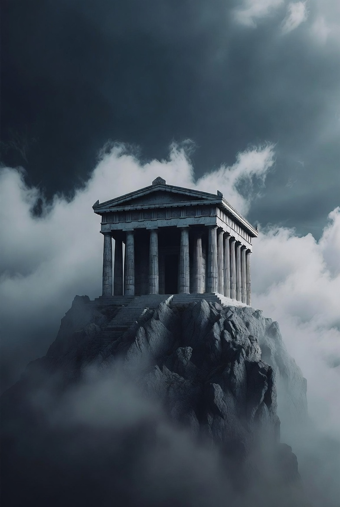
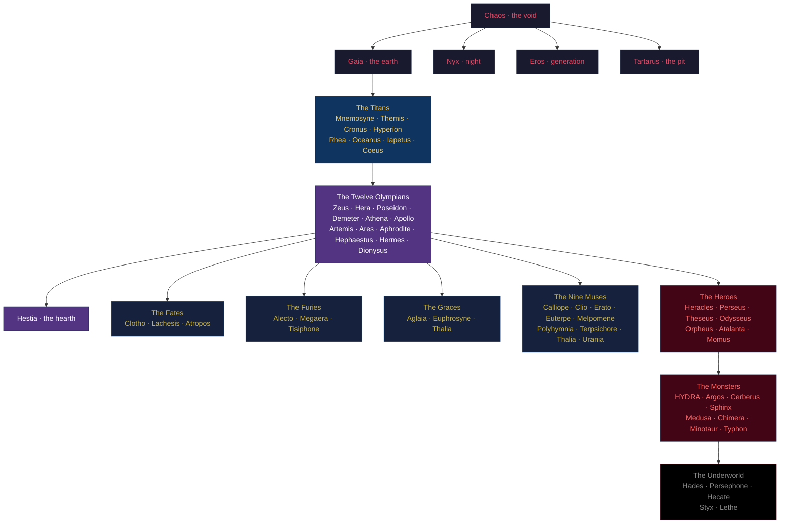

<div align="center">



```
                        ⚡  O L Y M P U S  ⚡
                ────────────────────────────────────
                 a cognitive substrate built in the
                    shape of greek mythology
```

**a complete pantheon · seventy-three named figures · zero abstractions you can't name**

[Cosmogony](codex/COSMOGONY.md) · [Pantheon](codex/PANTHEON.md) · [Rites](codex/RITES.md) · [Chronicle](codex/CHRONICLE.md) · [Prophecies](codex/PROPHECIES.md) · [Bestiary](codex/BESTIARY.md)

</div>

---

## What this is

Olympus is a cognitive substrate for AI agents, organized as Greek mythology.

Not "with greek-named modules." Organized **as** the mythology. The primordials underpin the titans, the titans underpin the Olympians, the Olympians command the heroes, the heroes confront the monsters, the Fates measure everything, the Furies punish broken oaths, the Graces make the output beautiful, and the Muses preserve every kind of record. Each tier owns a structural concern. Each god owns a single module. Every claim the system makes about itself is a Greek figure you can read about.

The mythology is not decoration. It is the architecture.

---

## The cosmogony



---

## The pantheon

```
                                  ⚡  Z E U S  ⚡
                              the operator's throne
                                       │
        ┌──────────────────────────────┼──────────────────────────────┐
        │                              │                              │
   T I T A N S                  O L Y M P I A N S              H E R O E S
   ─────────                    ─────────────                  ─────────
   Mnemosyne · memory           Zeus · authority               Heracles · 12 labors
   Themis · law                 Hera · bindings                Perseus · reflection
   Cronus · time                Poseidon · streams             Theseus · navigation
   Hyperion · light             Demeter · ingestion            Odysseus · long return
   Rhea · bootstrap             Athena · synthesis             Orpheus · descent
   Oceanus · I/O                Apollo · prophecy              Atalanta · speed
   Iapetus · lifecycle          Artemis · precision            Momus · criticism
   Coeus · inquiry              Ares · adversarial
                                Aphrodite · aesthetics
                                Hephaestus · architect
                                Hermes · messenger
                                Dionysus · transformation
                                Hestia · the hearth

   M O N S T E R S          F A T E S       F U R I E S      G R A C E S       M U S E S
   ──────────────           ─────────       ──────────       ─────────         ────────
   HYDRA · watchers         Clotho          Alecto           Aglaia            Calliope · epic
   Argos · swarm            Lachesis        Megaera          Euphrosyne        Clio · history
   Cerberus · gates         Atropos         Tisiphone        Thalia            Erato · warmth
   Sphinx · riddles                                                            Euterpe · rhythm
   Medusa · snapshots                                                          Melpomene · tragedy
   Chimera · composites                                                        Polyhymnia · oaths
   Minotaur · recursion                                                        Terpsichore · cadence
   Typhon · catastrophe                                                        Thalia · comedy
                                                                               Urania · brain-map

                        P R I M O R D I A L S                  U N D E R W O R L D
                        ────────────────                        ─────────────────
                        Chaos · void                           Hades · archive
                        Gaia · earth                           Persephone · cycles
                        Nyx · night                            Hecate · crossroads
                        Eros · generation                      Styx · oath chain
                        Tartarus · the pit                     Lethe · forgetting
```

---

## What each tier does

| Tier | Mythological role | Cognitive role |
|------|-------------------|----------------|
| **Primordials** | The first beings — Chaos, Gaia, Nyx, Tartarus, Eros | Substrate primitives: void, filesystem, background, quarantine, generation |
| **Titans** | Pre-Olympian gods, deep foundations | Constitution, memory, time, light, bootstrap, I/O, lifecycle, inquiry |
| **Olympians** | The twelve principal gods + Hestia | Operator, bindings, streams, ingestion, synthesis, prophecy, metrics, war, beauty, architect, messenger, transformation, hearth |
| **Underworld** | Hades's realm | Archive, cyclical state, error recovery, oath chain, ephemeral cache |
| **Fates** | The Moirai who weave every life | Creation, allocation, termination |
| **Furies** | Punishers of broken oaths | Invariant alerter, concurrency cop, integrity enforcer |
| **Graces** | Aphrodite's attendants | Banners, friendly errors, doc tone |
| **Muses** | Mnemosyne's nine daughters | One per kind of record — epic, history, warmth, rhythm, tragedy, oaths, cadence, comedy, brain-map |
| **Heroes** | Mortals who confronted the gods | Agent personas — kill-test, reflection, navigation, long-session, descent, speed, criticism |
| **Monsters** | The named beasts | Watcher tier (HYDRA), swarm (Argos), gate (Cerberus), riddle (Sphinx), snapshot (Medusa), composite-test (Chimera), recursion (Minotaur), catastrophe (Typhon) |

---

## Substrate invariants (S1–S8)

Eight claims that hold in every Olympus deployment, regardless of domain:

| | invariant | enforced by |
|-:|-----------|-------------|
| **S1** | Mnemosyne — every load-bearing decision is appended to an immutable record | Styx oath chain + per-kind JSONL |
| **S2** | Argos — no Eye uses randomness in its scan logic | Seeded determinism; replay test |
| **S3** | HYDRA — Heads observe; they never mutate | Read-only contract + static review |
| **S4** | Argos — no Eye imports another Eye | Decentralization; emergent synthesis only |
| **S5** | Apollo — every prediction is a falsifiable predicate | `verify()` callable required |
| **S6** | Delphi — MEDIUM / HIGH decisions are recorded in `oracles/delphi/` | Pre-ship gate refuses HIGH ships without |
| **S7** | Bounded autonomy — LOW automatic, MEDIUM proposed, HIGH requires Zeus's oath | `zeus.can_perform()` checks Styx |
| **S8** | Continuity of Understanding — every load-bearing action is reconstructible from the substrate alone | Mnemosyne + Styx + `eye_understanding_gap`; Momus AP6 |

Full text in [COSMOGONY.md](codex/COSMOGONY.md). Domain-specific invariants (C1–CN) live in your deployment's `DOMAIN.md`.

---

## Quickstart

```bash
# 1. clone Olympus
git clone https://github.com/EgorKhaklin/olympus ~/Desktop/my-agent
cd ~/Desktop/my-agent

# 2. install (editable) — exposes `invoke` as a console script
pip install -e .

# 3. bring forth the runtime directories
invoke bring-forth

# 4. light the hearth (one-time per deployment)
invoke kindle my-agent "one sentence on what this Olympus is for"

# 5. take a session bearing
invoke prime

# 6. consult the pantheon
invoke consult population
invoke consult chart

# 7. read the cosmogony
less codex/COSMOGONY.md
```

---

## Repository layout

```
Olympus/
├── README.md            you are here
├── LICENSE
├── NOTICE
├── SECURITY.md
├── pyproject.toml       pip-installable: `pip install -e .`
│
├── codex/               all prose
│   ├── COSMOGONY.md     constitution — substrate invariants S1–S8
│   ├── PANTHEON.md      registry of every named module
│   ├── RITES.md         agent runbook
│   ├── CHRONICLE.md     history
│   ├── PROPHECIES.md    roadmap
│   ├── BESTIARY.md      the monsters explained
│   ├── style.md         tone + style
│   ├── threat-model.md  substrate threats
│   ├── journal/         Clio writes daily
│   ├── postmortems/     Melpomene writes after failures
│   └── oracles/delphi/  strategic-decision archive
│
├── src/
│   └── olympus/         the importable Python package
│       ├── primordials/   chaos · gaia · nyx · tartarus · eros
│       ├── titans/        mnemosyne · themis · cronus · hyperion ·
│       │                  rhea · oceanus · iapetus · coeus
│       ├── olympians/     the twelve + hestia + apollo/ (subpackage)
│       ├── underworld/    hades · persephone · hecate · styx · lethe
│       ├── fates/         clotho · lachesis · atropos
│       ├── furies/        alecto · megaera · tisiphone
│       ├── graces/        aglaia · euphrosyne · thalia
│       ├── muses/         nine daughters of mnemosyne
│       ├── heroes/        heracles · perseus · theseus · odysseus ·
│       │                  orpheus · atalanta · momus
│       ├── monsters/      cerberus · sphinx · medusa · chimera ·
│       │   ├── hydra/     minotaur · typhon
│       │   │   └── heads/   8 mortal + 1 immortal
│       │   └── argos/
│       │       ├── eyes/      observation specialists
│       │       ├── satyrs/    concrete checks
│       │       ├── demes/     civic-class observers
│       │       └── phalanges/ battle formations
│       └── cli.py       Hermes-dispatched entry point
│
├── scripts/invoke       thin wrapper around olympus.cli:main
└── tests/               coherence + invariant + smoke + residue
```

---

## How it works

The pantheon is not a metaphor. Each god is a Python module whose docstring opens with the mythological role, then names what concern that role maps to in code. Reading any file teaches you both a piece of Greek myth and a piece of the system.

A typical session:

1. **Zeus** issues a directive (the operator names what to do)
2. **HYDRA**'s heads observe slices of the substrate; findings flow into Mnemosyne's append-only record
3. **Argos**'s eyes scan in parallel, depositing pheromones via the colony pattern
4. **Athena** synthesizes the findings into a brief
5. **Apollo** emits falsifiable predicates about the brief's implications
6. **Hephaestus** proposes a change; **Momus** contests it through the AP1–AP8 catalog
7. The decision is recorded at **Delphi** and sworn upon **Styx**
8. The **Furies** watch every step. If any invariant breaks, **Alecto** sounds an alarm that cannot be silenced.

The architecture is the mythology. The mythology is the architecture.

---

## Why this exists

Most cognitive substrates collapse into either abstract jargon (`ObservationCorrelator`, `DecisionAuditEngine`) or domain-specific names that don't transfer. Olympus uses Greek mythology because every educated person already shares the vocabulary, the relationships are pre-established (Hephaestus is the smith; Athena is the strategist; the Furies punish broken oaths), and the names compose: when Hephaestus proposes a change Momus contests, that is a sentence Greeks were telling each other 2,500 years before computing existed.

Mythology is the densest pre-existing API for talking about agents-among-agents. Olympus is what happens when you take that seriously.

---

<div align="center">

```
                    "May the threads spun for you be long,
                       and may the hearth-fire never go out."
```

Apache 2.0 · See [LICENSE](LICENSE) and [NOTICE](NOTICE)

</div>
