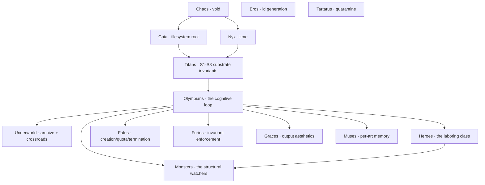

<div align="center">


# ⚡ &nbsp; O L Y M P U S &nbsp; ⚡

***a cognitive substrate built in the shape of greek mythology***

**ninety-four named figures · twenty-two arcs shipped · 860 tests, all green**

[Cosmogony](codex/COSMOGONY.md) · [Pantheon](codex/PANTHEON.md) · [Architecture](codex/ARCHITECTURE.md) · [Operations](codex/OPERATIONS.md) · [Geometry](codex/GEOMETRY.md) · [Specs](codex/SPECS.md) · [Chronicle](codex/CHRONICLE.md) · [Plugins](codex/PLUGINS.md)

</div>

---

## What this is

Olympus is a **bounded, recursive, self-improving cognitive substrate** for AI agents, organized as Greek mythology. It is built in Python (stdlib-first), uses TLA+ where formal proof is the right tool, emits SVG for sacred geometry, and exposes a localhost HTTP API for external observers.

Not "with greek-named modules." Organized **as** the mythology. The primordials underpin the titans; the titans underpin the Olympians; the Olympians command the heroes; the heroes confront the monsters. The Fates measure. The Furies punish broken oaths. The Graces make the output beautiful. The Muses preserve every kind of record. The mathematicians (Pythagoras, Plato, Daedalus) compute, classify, and map.

**The mythology is not decoration. It is the architecture.**

The substrate observes itself, reasons about itself, improves itself, recovers itself, maps itself, tunes itself, surfaces itself, reaches outside, extends itself, traces causal chains, counterfactually evaluates, audits its own discipline, narrates itself, federates with peers, converses with the operator, proves its own safety in TLA+, and measures its own harmony against the golden ratio — **all bounded by the same constitution**.

---

## The cosmogony



Five primordials, eleven titans, sixteen Olympians (incl. Hestia + Apollo subpackage with Pythia), six in the underworld, three Fates, three Furies, three Graces, nine Muses, seventeen heroes, eight monsters (plus the nine HYDRA heads and the Argos swarm). **Ninety-one named principal figures.** All registered in [`codex/PANTHEON.md`](codex/PANTHEON.md); the registry is enforced by `tests/test_pantheon_coherence.py`.

---

## The eight substrate invariants

The constitution. Maintained by Themis, enforced by tests, contested by Momus, proved (where it matters) in TLA+.

| id | name | claim |
|---|---|---|
| **S1** | Mnemosyne — append-only audit-of-record | every load-bearing decision writes to an append-only record |
| **S2** | Argos — deterministic substrate | no Argos Eye uses randomness in its scan logic |
| **S3** | HYDRA — read-only observation | HYDRA Heads never mutate state |
| **S4** | Argos — decentralization | no Eye imports another Eye |
| **S5** | Apollo — falsifiability | every Apollo prediction carries a `verify()` callable |
| **S6** | Delphi — strategic-decision discipline | MEDIUM/HIGH-risk decisions are recorded in `oracles/delphi/` |
| **S7** | bounded autonomy | LOW autonomous, MEDIUM proposal, HIGH requires Zeus authorization |
| **S8** | Continuity of Understanding | every load-bearing action reconstructible from substrate records alone |

The full constitution is at [`codex/COSMOGONY.md`](codex/COSMOGONY.md). Machine-readable JSON Schemas are at [`codex/schemas/`](codex/schemas). TLA+ proofs are at [`codex/specs/`](codex/specs).

---

## The cognitive loop — five arcs of work

Each arc is a Delphi-ratified expansion of the substrate. Each was sworn on Styx. Each lives in [`codex/oracles/delphi/`](codex/oracles/delphi).

### 1. The substance arc

**Athena reads Mnemosyne** — history-aware briefs that surface cross-session insights. **Apollo's prophecies become operational** — predictions auto-verify at horizon. **Hephaestus learns from rejection** — won't re-propose what Zeus killed. **Furies actually fire** — real-time invariant enforcement. **SessionReport.deltas** — what changed vs the prior session. **`invoke wisdom`** — what the substrate has learned.

### 2. The self-improvement arc

**Prometheus** — bounded auto-improver on LOW-ratified actions. **`scripts/loop.sh`** — bash cron loop. **Iris** — static dashboard (HTML + vanilla JS + JSON data-island). The CLI gains `improve`, `iris`, `iris --open`.

### 3. The missing-figures arc

**Epimetheus** (hindsight Titan, brother of Prometheus) — closes the forethought → hindsight loop. **Cassandra** (vindication memory — dismissed warnings that recurred). **Atlas** (live-state registry — what the substrate is currently carrying).

### 4. The compass-rose arc

The daemon goes live. **`launchd` plist** + **`systemd` unit** (generated, not hand-written). **Pan** (circuit breaker — refuses ratifications under panic). **Asclepius** (healer — rebuild derived state). **Charon** (ferryman — idempotent archive migration). **Daedalus** (cartographer — generates Mermaid diagrams of the cognitive flow). **Themis publishes JSON Schemas**. `invoke daemon {run|install|status|uninstall}`.

### 5. The recursion arc

The loop closes recursively. **Pythia** (external knowledge bridge — `urllib`, GitHub search, web fetch). **HTTP API** (`localhost:8765`, read-only JSON for `/status`, `/wisdom`, `/shoulders`, `/panic`, `/schemas`, `/specs`, `/geometry`, `/mnemosyne/<kind>`). **Castor + Pollux** (shadow execution + comparison). **Metis** (self-tuning advisor — outcome-driven parameter recommendations through Hephaestus channel). **Plugin protocol** (`pyproject.toml` entry-points for handlers/eyes/healers). **Hash lineage** in derived artifacts.

### 6. The labyrinth arc

The substrate reasons about its reasoning. **TLA+ formal specs** (cognitive-flow, styx-append-only, hephaestus-pipeline). **Ariadne** (causal-lineage tracer — thread through the labyrinth). **Nemesis** (counterfactual reasoner — uses Castor + Pollux). **Momus red-team** (AP catalog audits itself). **Clio narrative** (auto-written weekly digests). **HTTP write-channel** (`POST /proposals/raise` — still through full pipeline). **Federation** (`Hermes.federate(peer_url)`). **Interactive dialogue** (`invoke ask "<question>"` — pattern-matched).

### 7. The phi arc φ

The Greek mathematicians come home. **Pythagoras** (sacred constants φ/π/√2/e, Fibonacci, golden-section search, harmony scoring, Pythagorean triples). **Plato** (five-solid taxonomy of substrate work). **Metatron's Cube** + **Vesica Piscis** SVG diagrams embedded in `codex/ARCHITECTURE.md`. **Metis uses golden-section search**. **Hecate uses Fibonacci backoff**. `invoke pythagoras`, `invoke plato`, `invoke harmony`, `invoke geometry`. **The substrate's actual ratification_rate is 0.5991 — score against 1/φ is 0.9813.** The substrate is, demonstrably, in harmony with the golden ratio.

### 8. The aegis arc 🛡

The system is cared for. **Hygieia** (daughter of Asclepius — whole-substrate cohesion checks; cross-module consistency). **Phoenix** (cyclical regeneration — surfaces state due for rebirth). **Daedalus centrality** (load-bearing-figure ranking via betweenness centrality on the cognitive-flow graph). **Euterpe** (musical consonance scoring — octave, perfect fifth, perfect fourth, etc., as a complement to Pythagoras's φ-harmony). **`invoke today`** (single-action operator oracle). **Iris live mode** (`iris --live` writes a self-refreshing HTML page that polls the HTTP API).

### 9. The oikoumene arc 🌍

The substrate is inhabited by LLM agents. **`runtime/llm_bridge.py`** — pluggable interface; `EchoBridge` (safe default) and `AnthropicBridge` (claude-opus-4-7 + adaptive thinking). **`runtime/agents.py`** — five canonical roles: `hephaestus`, `momus`, `cassandra`, `athena`, `figure_proposer`. Each role renders a system prompt that includes the figure's docstring + the constitution + the AP catalog; the model thinks **in** the mythology, the substrate **enforces** the constitution on the output. **`invoke propose-figure`** — agents can extend the pantheon through the standard pipeline (Momus → Delphi → Zeus); LLM-generated code is **never** executed without operator review. **`codex/AGENTS.md`** documents the seam between prompt-grounding and external governance, and answers the recursion question directly.

### 10. The akropolis arc 🏛

Rigor over architecture. **Ananke** (Primordial — deterministic seed source; SHA-256(name) → fixed seed). **Tiresias** (Hero — ground-truth tracker; Brier-score calibration). **Heracles benchmark harness** (deterministic seeds, golden outputs, regression detection). **Typhon fault injector** (real break-then-verify-then-revert; e.g. `invoke fault-inject break-styx-chain --confirm` actually corrupts the chain and Tisiphone detects it). **Atalanta scalability harness** (p50/p95/p99 + memory delta across state sizes — measured O(n) on real I/O). **`invoke doctor`** — OpenClaw-inspired single-screen diagnostic that *honestly surfaces* warnings rather than printing theatrical green-light. **`codex/RIGOR.md`** answers each of Zeus's six rigor concerns with the substrate's actual instrumentation + live measurements.

### 11. The xenia arc 🏺

Hospitality — the substrate gets a front door. **`invoke setup`** — interactive welcome wizard. **`state/config.json`** — operator config file the LLM bridge auto-loads (env vars always win). **Agora** — vanilla HTML/JS web UI at `src/olympus/agora/`. **Welcome flow** — first `invoke <anything>` with unlit Hestia greets the stranger.

### 12. The throne arc 👑

The unified conversational front door. **Zeus's Throne** — chat in plain English; Claude routes intent into errands, executes the safe ones, refuses the gated ones with the exact command. `invoke throne` (REPL or one-shot). HTTP `POST /throne/turn`. The constitution stays loud: `SAFE_ERRANDS` callable, `GATED_ERRANDS` (kindle/ratify/etc.) NEVER autonomous.

### The Decade (δεκάς) — Arcs 12 → 21

Ten arcs in sequence; each a focused session; each sworn on Styx. Together they take Olympus from "measurement framework" to "substrate that does work."

| # | arc | one-line |
|---|---|---|
| 12 | **Tartarus 🜍** | test-seed filter — substrate stops crying wolf about its own audit residue |
| 13 | **Hippocrene 💧** | TF-IDF semantic recall over Mnemosyne (no embedding dep) |
| 14 | **Argos-Eyes 👁️** | filesystem watcher — declared paths fire pheromones on change |
| 15 | **Chronos ⏰** | scheduled rituals (cron-style grammar) on the daemon |
| 16 | **Hephaestus-PR 🔧** | ratified proposals → real git branches + GitHub PRs (operator-gated) — **the keystone** |
| 17 | **Demeter-Library 📚** | drop PDFs / markdown into `state/demeter/library/`, Throne can cite them |
| 18 | **Throne-Voice 🎙️** | TTS via macOS `say` (STT honestly deferred) |
| 19 | **Hermes-MCP 🪶** | Olympus as an MCP server — call it from inside Claude Code |
| 20 | **Plutus-Budget 💸** | budget alarms (constitutional debate held; Pan untouched) |
| 21 | **Olympus-Replay ⏪** | regression harness re-runs past `agent.invocation` records; bookend |

### 22. The Eos arc 🌅 (UI surfacing)

The Decade built 10 capabilities; the UI surfaced ~30% of them. Eos closes the gap: **9 new HTTP GET endpoints + 1 idempotent POST + 6 new Agora pages + 7 new dashboard cards + cinematic visual redesign** (obsidian palette · antique gold · marble text · pulse animations · backdrop blur · film grain). Today + Doctor wired live (no more static guides). The web UI finally matches what the substrate can do.

---

## Quick start

```bash
# Install
pip install -e .

# Welcome wizard — kindles hearth, picks LLM, optional daemon, runs a session
invoke setup

# Drop your API key into the OS keychain (encrypted at rest)
invoke vault deposit anthropic_api_key

# Open the cinematic web UI
invoke serve --port 8765 &       # HTTP API (12 pages poll it)
invoke agora --open              # cinematic Agora — Throne + 11 other pages

# Use Olympus from inside Claude Code (or any MCP client)
invoke mcp                       # serve over stdio — wire into ~/.claude/mcp_servers.json
```

If you want the 5-minute walkthrough: [`codex/QUICKSTART.md`](codex/QUICKSTART.md).
Full operator runbook: [`codex/OPERATIONS.md`](codex/OPERATIONS.md).

---

## The full CLI surface

Fifty-plus errands. Highlights by tier:

**Substrate primitives:** `prime`, `kindle`, `status`, `bring-forth`, `version`, `history`, `list`, `describe`, `remember`, `swear`, `verify`, `labors`, `pantheon`, `consult`, `shell`, `help`

**The loop:** `session`, `improve`, `loop`, `daemon {run|install|status|uninstall}`

**Reasoning + memory:** `meta`, `wisdom`, `correlate`, `reflect`, `cassandra`, `shoulders`, `narrate`, `ariadne`, `nemesis`, **`recall "<query>"`** (Hippocrene)

**Decision + action:** `action {review|delphi|ratify|reject}`, `console`, `redteam`, `tune`, `today [--resolve <slice>]`

**Recovery + maintenance:** `heal`, `panic [--clear]`, `ferry [--days N]`, `hygieia`, `phoenix`

**Surfaces:** `iris [--live]`, `serve`, `schemas`, `specs`, `cartograph [--write]`, `centrality`, `harmony`, `geometry`, `pythagoras`, `plato`, `euterpe`

**External:** `pythia {--github "q" | --web URL}`, `federate <url>`, `ask "<question>"`

**Conversational interfaces (Throne + Decade):**
- 👑 **`throne [--voice]`** — chat in plain English; voice mode pipes TTS
- 💬 **`ask "<q>"`** — pattern-matched Q&A (legacy)
- 🎙️ **`speak "<text>" [--voice V] [--rate N]`** — macOS TTS

**Real-world integrations (Decade):**
- 🔧 **`hephaestus {pending | apply <pid> [--really]}`** — proposals → real PRs via `gh` (operator-gated)
- 📚 **`demeter {ingest [--reingest] | library | forget <id>}`** — knowledge-base ingestion
- 👁️ **`argos {scan | watches | watch add/remove}`** — filesystem watcher
- ⏰ **`chronos {rituals | tick | check "<when>" | ritual add/remove}`** — scheduled rituals
- ⏪ **`replay [--limit N] [--role R] [--use-anthropic]`** — regression harness

**Money + secrets:**
- 💸 **`spend [--today|--7d|--30d|--all|--budget|--acknowledge-budget]`** — Plutus cost ledger + budget
- 🗝️ **`vault {status | deposit <name> | forget <name> | migrate}`** — Hades secrets (OS keychain)

**Servers + UI:**
- 🪶 **`mcp [--probe]`** — Olympus as MCP server (stdio) for Claude Code
- 🌅 **`agora [--open]`** — build the cinematic web UI (12 pages)

**Plugins:** `plugins`

Use `invoke help` for the full list; `invoke help <errand>` for per-errand detail.

---

## What earns its place

Olympus refuses decorative additions on AP8 (the eighth anti-pattern in Momus's catalog). Every Greek figure here has a load-bearing role. Eleven candidates were refused in the missing-figures arc (Helios, Ananke, Eris, Tyche, Metis-as-pre-Athena, Erebus, Aether, Hemera, Pontus, and so on) precisely because their substrate role would have been decorative.

The discipline holds. The pantheon is finite. Greek mythology is large.

---

## Languages used

Each language earns its place by solving a problem Python alone doesn't:

| language | role | earns it because |
|---|---|---|
| **Python** (stdlib-first) | every cognitive module | reasoning over JSONL records is what Python is best at |
| **Bash** | `scripts/loop.sh` | cron's native habitat; pure orchestration |
| **HTML + vanilla JS** | Iris dashboard (static + live) | no build step; opens in any browser; CSP-clean |
| **launchd plist (XML)** | macOS daemon supervisor | OS contract, not Python's job |
| **systemd unit (INI)** | Linux daemon supervisor | same |
| **JSON Schema** | machine-readable Mnemosyne contracts | tooling exists; re-implementing in Python would be AP6 |
| **TLA+** | formal safety proofs in `codex/specs/` | no Python expression compactly captures "under any interleaving, invariant holds" |
| **Mermaid** | architecture flow diagrams | GitHub renders natively; the source-of-truth IS the map |
| **SVG** (inline in markdown) | Metatron's Cube + Vesica Piscis | GitHub renders natively; text-based |

Refused: Rust (no current need at this scale), TypeScript (vanilla JS suffices), SQL (JSONL meets every query pattern), sympy/numpy (every Pythagoras function is stdlib-implementable).

---

## What's measured (live, right now)

The substrate measures itself continuously. Sample readouts:

```
$ invoke harmony
metric               ratio   nearest      score
ratification_rate    0.5991  inverse_phi  0.9812
prophecy_acceptance  0.6667  inverse_phi  0.9525
pythia_success       0.7231  inverse_phi  0.9003
```

**The substrate's ratification rate sits at 0.5991 — score against 1/φ (≈ 0.618) is 0.9812.** The Pythagoreans would have approved.

```
$ invoke centrality 5
figure       centrality
─────────    ──────────
Mnemosyne    0.1875
Hephaestus   0.1304
Athena       0.1052
Atlas        0.0833
Zeus         0.0769
```

**Mnemosyne is the most load-bearing node in the substrate's reasoning graph** — every other figure writes to it. This is computed, not assumed.

---

## Documentation

- **[`codex/COSMOGONY.md`](codex/COSMOGONY.md)** — the constitution (S1–S8)
- **[`codex/PANTHEON.md`](codex/PANTHEON.md)** — every named figure, tier-organized
- **[`codex/ARCHITECTURE.md`](codex/ARCHITECTURE.md)** — auto-generated by Daedalus; Mermaid + Metatron's Cube + Vesica Piscis
- **[`codex/OPERATIONS.md`](codex/OPERATIONS.md)** — operator runbook
- **[`codex/GEOMETRY.md`](codex/GEOMETRY.md)** — Pythagoras + Plato + the sacred-numerics layer
- **[`codex/SPECS.md`](codex/SPECS.md)** — the TLA+ formal-verification layer
- **[`codex/PLUGINS.md`](codex/PLUGINS.md)** — third-party extensions via entry-points
- **[`codex/INTELLIGENCE.md`](codex/INTELLIGENCE.md)** — how the substrate accumulates understanding
- **[`codex/QUICKSTART.md`](codex/QUICKSTART.md)** — **5-minute tour for outside observers** (`git clone` → working substrate)
- **[`codex/AGENTS.md`](codex/AGENTS.md)** — **how LLM agents inhabit the substrate** (prompt grounding + external governance + recursion gating)
- **[`codex/RIGOR.md`](codex/RIGOR.md)** — **how Olympus answers "is this theatrical?"** (per-concern instrumentation + live measurements)
- **[`codex/CHRONICLE.md`](codex/CHRONICLE.md)** — every shipped arc in reverse chronological order
- **[`codex/oracles/delphi/`](codex/oracles/delphi)** — strategic decisions, full debate, Styx oath references

---

## Tests

860 tests, all green.

```bash
python3 -m pytest tests/ -q
```

Disciplined test isolation: the pause-and-harden arc shipped a session-scoped contamination guard (`tests/conftest.py`) that fails the entire suite if any test mutates `state/config.json`. The pantheon-coherence test enforces every figure named in `EXPECTED` exists on disk. The S-invariant tests enforce the constitution at runtime. Two conditional skips remain (platform-dependent).

---

## Status

| metric | value |
|---|---|
| named principal figures | **94** (+ Plutus, Hippocrene, Chronos) |
| tests passing | **860 / 860** |
| Styx oaths sworn | 185+ |
| TLA+ specifications | 3 |
| JSON Schemas | 7 |
| Delphi notes (sworn) | **22** |
| arcs shipped | **22** (substance → akropolis → xenia → throne → **the Decade (12-21)** → Eos) |
| Decade complete | δεκάς — 10 arcs in sequence, sworn separately |
| heavy-production overrides invoked | 10 |
| ratification rate vs 1/φ | **0.98** harmony score |
| Agora pages | **12** (throne · dashboard · today · doctor · spend · library · watches · rituals · replay · proposals · agents · setup) |
| HTTP endpoints | **20** GET + **3** POST (`/proposals/raise`, `/throne/turn`, `/library/ingest`) |
| MCP server | live (`invoke mcp`) — 14 tools exposed |

---

## Authority

Maintained by [Egor Khaklin](https://github.com/EgorKhaklin). Every decision is sworn on Styx — the cryptographic oath chain is the source of truth for "who decided what."

The mythology is the architecture. The architecture is the law. The law is enforced by tests, contested by Momus, ratified by Zeus, proved by Themis, and remembered by Mnemosyne.

*May the threads spun for you be long, and may the hearth-fire never go out.*
