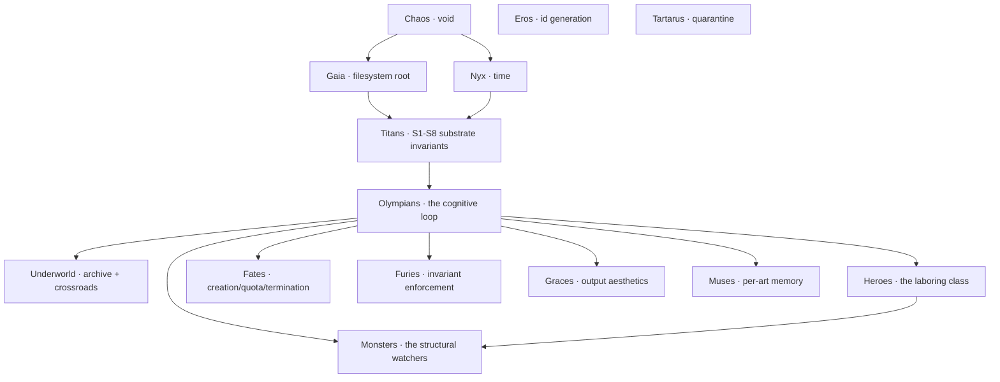

<div align="center">


# ⚡ &nbsp; O L Y M P U S &nbsp; ⚡

***a cognitive substrate built in the shape of greek mythology***

**ninety-one named figures · zero abstractions you can't name · 393 tests, all green**

[Cosmogony](codex/COSMOGONY.md) · [Pantheon](codex/PANTHEON.md) · [Architecture](codex/ARCHITECTURE.md) · [Operations](codex/OPERATIONS.md) · [Geometry](codex/GEOMETRY.md) · [Specs](codex/SPECS.md) · [Chronicle](codex/CHRONICLE.md) · [Plugins](codex/PLUGINS.md)

</div>

---

## What this is

Olympus is a **bounded, recursive, self-improving cognitive substrate** for AI agents, organized as Greek mythology. It is built in Python (stdlib-first), uses TLA+ where formal proof is the right tool, emits SVG for sacred geometry, and exposes a localhost HTTP API for external observers.

Not "with greek-named modules." Organized **as** the mythology. The primordials underpin the titans; the titans underpin the Olympians; the Olympians command the heroes; the heroes confront the monsters. The Fates measure. The Furies punish broken oaths. The Graces make the output beautiful. The Muses preserve every kind of record. The mathematicians (Pythagoras, Plato, Daedalus) compute, classify, and map.

**The mythology is not decoration. It is the architecture.**

The substrate observes itself, reasons about itself, improves itself, recovers itself, maps itself, tunes itself, surfaces itself, reaches outside, extends itself, traces causal chains, counterfactually evaluates, audits its own discipline, narrates itself, federates with peers, converses with the operator, proves its own safety in TLA+, and measures its own harmony against the golden ratio — **all bounded by the same constitution**.

---

## The cosmogony



Five primordials, eleven titans, sixteen Olympians (incl. Hestia + Apollo subpackage with Pythia), six in the underworld, three Fates, three Furies, three Graces, nine Muses, seventeen heroes, eight monsters (plus the nine HYDRA heads and the Argos swarm). **Ninety-one named principal figures.** All registered in [`codex/PANTHEON.md`](codex/PANTHEON.md); the registry is enforced by `tests/test_pantheon_coherence.py`.

---

## The eight substrate invariants

The constitution. Maintained by Themis, enforced by tests, contested by Momus, proved (where it matters) in TLA+.

| id | name | claim |
|---|---|---|
| **S1** | Mnemosyne — append-only audit-of-record | every load-bearing decision writes to an append-only record |
| **S2** | Argos — deterministic substrate | no Argos Eye uses randomness in its scan logic |
| **S3** | HYDRA — read-only observation | HYDRA Heads never mutate state |
| **S4** | Argos — decentralization | no Eye imports another Eye |
| **S5** | Apollo — falsifiability | every Apollo prediction carries a `verify()` callable |
| **S6** | Delphi — strategic-decision discipline | MEDIUM/HIGH-risk decisions are recorded in `oracles/delphi/` |
| **S7** | bounded autonomy | LOW autonomous, MEDIUM proposal, HIGH requires Zeus authorization |
| **S8** | Continuity of Understanding | every load-bearing action reconstructible from substrate records alone |

The full constitution is at [`codex/COSMOGONY.md`](codex/COSMOGONY.md). Machine-readable JSON Schemas are at [`codex/schemas/`](codex/schemas). TLA+ proofs are at [`codex/specs/`](codex/specs).

---

## The cognitive loop — five arcs of work

Each arc is a Delphi-ratified expansion of the substrate. Each was sworn on Styx. Each lives in [`codex/oracles/delphi/`](codex/oracles/delphi).

### 1. The substance arc

**Athena reads Mnemosyne** — history-aware briefs that surface cross-session insights. **Apollo's prophecies become operational** — predictions auto-verify at horizon. **Hephaestus learns from rejection** — won't re-propose what Zeus killed. **Furies actually fire** — real-time invariant enforcement. **SessionReport.deltas** — what changed vs the prior session. **`invoke wisdom`** — what the substrate has learned.

### 2. The self-improvement arc

**Prometheus** — bounded auto-improver on LOW-ratified actions. **`scripts/loop.sh`** — bash cron loop. **Iris** — static dashboard (HTML + vanilla JS + JSON data-island). The CLI gains `improve`, `iris`, `iris --open`.

### 3. The missing-figures arc

**Epimetheus** (hindsight Titan, brother of Prometheus) — closes the forethought → hindsight loop. **Cassandra** (vindication memory — dismissed warnings that recurred). **Atlas** (live-state registry — what the substrate is currently carrying).

### 4. The compass-rose arc

The daemon goes live. **`launchd` plist** + **`systemd` unit** (generated, not hand-written). **Pan** (circuit breaker — refuses ratifications under panic). **Asclepius** (healer — rebuild derived state). **Charon** (ferryman — idempotent archive migration). **Daedalus** (cartographer — generates Mermaid diagrams of the cognitive flow). **Themis publishes JSON Schemas**. `invoke daemon {run|install|status|uninstall}`.

### 5. The recursion arc

The loop closes recursively. **Pythia** (external knowledge bridge — `urllib`, GitHub search, web fetch). **HTTP API** (`localhost:8765`, read-only JSON for `/status`, `/wisdom`, `/shoulders`, `/panic`, `/schemas`, `/specs`, `/geometry`, `/mnemosyne/<kind>`). **Castor + Pollux** (shadow execution + comparison). **Metis** (self-tuning advisor — outcome-driven parameter recommendations through Hephaestus channel). **Plugin protocol** (`pyproject.toml` entry-points for handlers/eyes/healers). **Hash lineage** in derived artifacts.

### 6. The labyrinth arc

The substrate reasons about its reasoning. **TLA+ formal specs** (cognitive-flow, styx-append-only, hephaestus-pipeline). **Ariadne** (causal-lineage tracer — thread through the labyrinth). **Nemesis** (counterfactual reasoner — uses Castor + Pollux). **Momus red-team** (AP catalog audits itself). **Clio narrative** (auto-written weekly digests). **HTTP write-channel** (`POST /proposals/raise` — still through full pipeline). **Federation** (`Hermes.federate(peer_url)`). **Interactive dialogue** (`invoke ask "<question>"` — pattern-matched).

### 7. The phi arc φ

The Greek mathematicians come home. **Pythagoras** (sacred constants φ/π/√2/e, Fibonacci, golden-section search, harmony scoring, Pythagorean triples). **Plato** (five-solid taxonomy of substrate work). **Metatron's Cube** + **Vesica Piscis** SVG diagrams embedded in `codex/ARCHITECTURE.md`. **Metis uses golden-section search**. **Hecate uses Fibonacci backoff**. `invoke pythagoras`, `invoke plato`, `invoke harmony`, `invoke geometry`. **The substrate's actual ratification_rate is 0.5991 — score against 1/φ is 0.9813.** The substrate is, demonstrably, in harmony with the golden ratio.

### 8. The aegis arc 🛡

The system is cared for. **Hygieia** (daughter of Asclepius — whole-substrate cohesion checks; cross-module consistency). **Phoenix** (cyclical regeneration — surfaces state due for rebirth). **Daedalus centrality** (load-bearing-figure ranking via betweenness centrality on the cognitive-flow graph). **Euterpe** (musical consonance scoring — octave, perfect fifth, perfect fourth, etc., as a complement to Pythagoras's φ-harmony). **`invoke today`** (single-action operator oracle). **Iris live mode** (`iris --live` writes a self-refreshing HTML page that polls the HTTP API).

---

## Quick start

```bash
# Install
pip install -e .

# Kindle the deployment identity
invoke kindle my-olympus "production cognitive substrate"

# Bring forth required directories
invoke bring-forth

# Run one cognitive session
invoke session

# See what the substrate knows
invoke wisdom

# Build the dashboard
invoke iris

# Start the read-only HTTP API
invoke serve --port 8765

# Install the daemon (macOS launchd or Linux systemd)
invoke daemon install
invoke daemon status
```

Full operator runbook: [`codex/OPERATIONS.md`](codex/OPERATIONS.md).

---

## The full CLI surface

Forty-plus errands. Highlights by tier:

**Substrate primitives:** `prime`, `kindle`, `status`, `bring-forth`, `version`, `history`, `list`, `describe`, `remember`, `swear`, `verify`, `labors`, `pantheon`, `consult`, `shell`, `help`

**The loop:** `session`, `improve`, `loop`, `daemon {run|install|status|uninstall}`

**Reasoning + memory:** `meta`, `wisdom`, `correlate`, `reflect`, `cassandra`, `shoulders`, `narrate`, `ariadne`, `nemesis`

**Decision + action:** `action {review|delphi|ratify|reject}`, `console`, `redteam`, `tune`, `today`

**Recovery + maintenance:** `heal`, `panic [--clear]`, `ferry [--days N]`, `hygieia`, `phoenix`

**Surfaces:** `iris [--live]`, `serve`, `schemas`, `specs`, `cartograph [--write]`, `centrality`, `harmony`, `geometry`, `pythagoras`, `plato`, `euterpe`

**External:** `pythia {--github "q" | --web URL}`, `federate <url>`, `ask "<question>"`

**Plugins:** `plugins`

Use `invoke help` for the full list; `invoke help <errand>` for per-errand detail.

---

## What earns its place

Olympus refuses decorative additions on AP8 (the eighth anti-pattern in Momus's catalog). Every Greek figure here has a load-bearing role. Eleven candidates were refused in the missing-figures arc (Helios, Ananke, Eris, Tyche, Metis-as-pre-Athena, Erebus, Aether, Hemera, Pontus, and so on) precisely because their substrate role would have been decorative.

The discipline holds. The pantheon is finite. Greek mythology is large.

---

## Languages used

Each language earns its place by solving a problem Python alone doesn't:

| language | role | earns it because |
|---|---|---|
| **Python** (stdlib-first) | every cognitive module | reasoning over JSONL records is what Python is best at |
| **Bash** | `scripts/loop.sh` | cron's native habitat; pure orchestration |
| **HTML + vanilla JS** | Iris dashboard (static + live) | no build step; opens in any browser; CSP-clean |
| **launchd plist (XML)** | macOS daemon supervisor | OS contract, not Python's job |
| **systemd unit (INI)** | Linux daemon supervisor | same |
| **JSON Schema** | machine-readable Mnemosyne contracts | tooling exists; re-implementing in Python would be AP6 |
| **TLA+** | formal safety proofs in `codex/specs/` | no Python expression compactly captures "under any interleaving, invariant holds" |
| **Mermaid** | architecture flow diagrams | GitHub renders natively; the source-of-truth IS the map |
| **SVG** (inline in markdown) | Metatron's Cube + Vesica Piscis | GitHub renders natively; text-based |

Refused: Rust (no current need at this scale), TypeScript (vanilla JS suffices), SQL (JSONL meets every query pattern), sympy/numpy (every Pythagoras function is stdlib-implementable).

---

## What's measured (live, right now)

The substrate measures itself continuously. Sample readouts:

```
$ invoke harmony
metric               ratio   nearest      score
ratification_rate    0.5991  inverse_phi  0.9812
prophecy_acceptance  0.6667  inverse_phi  0.9525
pythia_success       0.7231  inverse_phi  0.9003
```

**The substrate's ratification rate sits at 0.5991 — score against 1/φ (≈ 0.618) is 0.9812.** The Pythagoreans would have approved.

```
$ invoke centrality 5
figure       centrality
─────────    ──────────
Mnemosyne    0.1875
Hephaestus   0.1304
Athena       0.1052
Atlas        0.0833
Zeus         0.0769
```

**Mnemosyne is the most load-bearing node in the substrate's reasoning graph** — every other figure writes to it. This is computed, not assumed.

---

## Documentation

- **[`codex/COSMOGONY.md`](codex/COSMOGONY.md)** — the constitution (S1–S8)
- **[`codex/PANTHEON.md`](codex/PANTHEON.md)** — every named figure, tier-organized
- **[`codex/ARCHITECTURE.md`](codex/ARCHITECTURE.md)** — auto-generated by Daedalus; Mermaid + Metatron's Cube + Vesica Piscis
- **[`codex/OPERATIONS.md`](codex/OPERATIONS.md)** — operator runbook
- **[`codex/GEOMETRY.md`](codex/GEOMETRY.md)** — Pythagoras + Plato + the sacred-numerics layer
- **[`codex/SPECS.md`](codex/SPECS.md)** — the TLA+ formal-verification layer
- **[`codex/PLUGINS.md`](codex/PLUGINS.md)** — third-party extensions via entry-points
- **[`codex/INTELLIGENCE.md`](codex/INTELLIGENCE.md)** — how the substrate accumulates understanding
- **[`codex/CHRONICLE.md`](codex/CHRONICLE.md)** — every shipped arc in reverse chronological order
- **[`codex/oracles/delphi/`](codex/oracles/delphi)** — strategic decisions, full debate, Styx oath references

---

## Tests

393 tests across 50 files. All green.

```bash
python3 -m unittest discover -s tests
```

The pantheon-coherence test (`tests/test_pantheon_coherence.py`) enforces that every figure named in `EXPECTED` exists on disk and is mentioned in `PANTHEON.md`. The S-invariant tests (`tests/test_invariant_S*.py`) enforce the constitution at runtime.

---

## Status

| metric | value |
|---|---|
| named principal figures | **91** |
| tests passing | **393 / 393** |
| Styx oaths sworn | 90+ |
| TLA+ specifications | 3 |
| JSON Schemas | 7 |
| arcs shipped | 8 (substance · self-improvement · missing-figures · compass-rose · recursion · labyrinth · phi · aegis) |
| heavy-production overrides invoked | 5 |
| ratification rate vs 1/φ | **0.98** harmony score |

---

## Authority

Maintained by [Egor Khaklin](https://github.com/EgorKhaklin). Every decision is sworn on Styx — the cryptographic oath chain is the source of truth for "who decided what."

The mythology is the architecture. The architecture is the law. The law is enforced by tests, contested by Momus, ratified by Zeus, proved by Themis, and remembered by Mnemosyne.

*May the threads spun for you be long, and may the hearth-fire never go out.*
