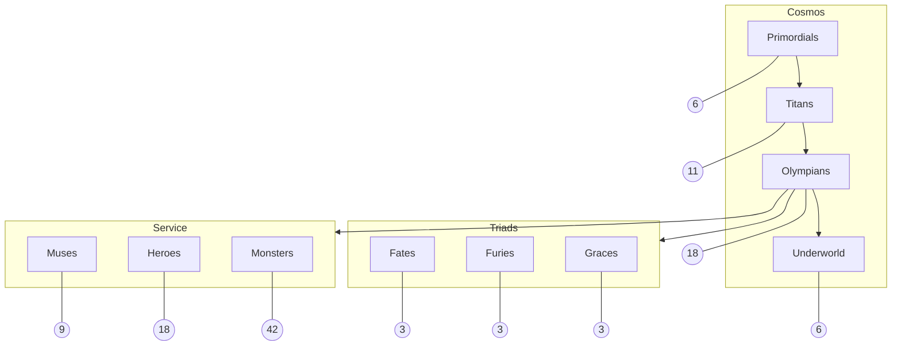

# ARCHITECTURE

**the labyrinth made visible**

*generated by Daedalus — 2026-05-19T03:12:06.000544+00:00*

<!-- lineage: cognitive-flow-sha256=692abd4fe8993361ad5735d7c31dd86238f422732789f21fcc21e8f8afae9e07 -->

---

## The thirteen — Metatron's Cube

The twelve Olympians plus Hestia, arranged in the canonical sacred-
geometry layout. Every node connects to every other node; the inner
ring is the seed-of-life hexagon; Zeus sits at the cosmic axis.

<svg xmlns="http://www.w3.org/2000/svg" viewBox="0 0 520 520" role="img" aria-label="Metatron's Cube of the 13 canonical Olympian figures" style="background:#0f0f17">
  <defs>
    
  </defs>
  <!-- vesica-piscis ring of seed-of-life circles -->
  <circle class="vesica" cx="260.00" cy="260.00" r="93.60"/>
  <circle class="vesica" cx="260.00" cy="166.40" r="93.60"/>
  <circle class="vesica" cx="341.06" cy="213.20" r="93.60"/>
  <circle class="vesica" cx="341.06" cy="306.80" r="93.60"/>
  <circle class="vesica" cx="260.00" cy="353.60" r="93.60"/>
  <circle class="vesica" cx="178.94" cy="306.80" r="93.60"/>
  <circle class="vesica" cx="178.94" cy="213.20" r="93.60"/>
  <circle class="vesica" cx="353.60" cy="97.88" r="93.60"/>
  <circle class="vesica" cx="447.20" cy="260.00" r="93.60"/>
  <circle class="vesica" cx="353.60" cy="422.12" r="93.60"/>
  <circle class="vesica" cx="166.40" cy="422.12" r="93.60"/>
  <circle class="vesica" cx="72.80" cy="260.00" r="93.60"/>
  <circle class="vesica" cx="166.40" cy="97.88" r="93.60"/>
  <!-- every-to-every edges -->
  <line class="edge" x1="260.00" y1="260.00" x2="260.00" y2="166.40"/>
  <line class="edge" x1="260.00" y1="260.00" x2="341.06" y2="213.20"/>
  <line class="edge" x1="260.00" y1="260.00" x2="341.06" y2="306.80"/>
  <line class="edge" x1="260.00" y1="260.00" x2="260.00" y2="353.60"/>
  <line class="edge" x1="260.00" y1="260.00" x2="178.94" y2="306.80"/>
  <line class="edge" x1="260.00" y1="260.00" x2="178.94" y2="213.20"/>
  <line class="edge" x1="260.00" y1="260.00" x2="353.60" y2="97.88"/>
  <line class="edge" x1="260.00" y1="260.00" x2="447.20" y2="260.00"/>
  <line class="edge" x1="260.00" y1="260.00" x2="353.60" y2="422.12"/>
  <line class="edge" x1="260.00" y1="260.00" x2="166.40" y2="422.12"/>
  <line class="edge" x1="260.00" y1="260.00" x2="72.80" y2="260.00"/>
  <line class="edge" x1="260.00" y1="260.00" x2="166.40" y2="97.88"/>
  <line class="edge" x1="260.00" y1="166.40" x2="341.06" y2="213.20"/>
  <line class="edge" x1="260.00" y1="166.40" x2="341.06" y2="306.80"/>
  <line class="edge" x1="260.00" y1="166.40" x2="260.00" y2="353.60"/>
  <line class="edge" x1="260.00" y1="166.40" x2="178.94" y2="306.80"/>
  <line class="edge" x1="260.00" y1="166.40" x2="178.94" y2="213.20"/>
  <line class="edge" x1="260.00" y1="166.40" x2="353.60" y2="97.88"/>
  <line class="edge" x1="260.00" y1="166.40" x2="447.20" y2="260.00"/>
  <line class="edge" x1="260.00" y1="166.40" x2="353.60" y2="422.12"/>
  <line class="edge" x1="260.00" y1="166.40" x2="166.40" y2="422.12"/>
  <line class="edge" x1="260.00" y1="166.40" x2="72.80" y2="260.00"/>
  <line class="edge" x1="260.00" y1="166.40" x2="166.40" y2="97.88"/>
  <line class="edge" x1="341.06" y1="213.20" x2="341.06" y2="306.80"/>
  <line class="edge" x1="341.06" y1="213.20" x2="260.00" y2="353.60"/>
  <line class="edge" x1="341.06" y1="213.20" x2="178.94" y2="306.80"/>
  <line class="edge" x1="341.06" y1="213.20" x2="178.94" y2="213.20"/>
  <line class="edge" x1="341.06" y1="213.20" x2="353.60" y2="97.88"/>
  <line class="edge" x1="341.06" y1="213.20" x2="447.20" y2="260.00"/>
  <line class="edge" x1="341.06" y1="213.20" x2="353.60" y2="422.12"/>
  <line class="edge" x1="341.06" y1="213.20" x2="166.40" y2="422.12"/>
  <line class="edge" x1="341.06" y1="213.20" x2="72.80" y2="260.00"/>
  <line class="edge" x1="341.06" y1="213.20" x2="166.40" y2="97.88"/>
  <line class="edge" x1="341.06" y1="306.80" x2="260.00" y2="353.60"/>
  <line class="edge" x1="341.06" y1="306.80" x2="178.94" y2="306.80"/>
  <line class="edge" x1="341.06" y1="306.80" x2="178.94" y2="213.20"/>
  <line class="edge" x1="341.06" y1="306.80" x2="353.60" y2="97.88"/>
  <line class="edge" x1="341.06" y1="306.80" x2="447.20" y2="260.00"/>
  <line class="edge" x1="341.06" y1="306.80" x2="353.60" y2="422.12"/>
  <line class="edge" x1="341.06" y1="306.80" x2="166.40" y2="422.12"/>
  <line class="edge" x1="341.06" y1="306.80" x2="72.80" y2="260.00"/>
  <line class="edge" x1="341.06" y1="306.80" x2="166.40" y2="97.88"/>
  <line class="edge" x1="260.00" y1="353.60" x2="178.94" y2="306.80"/>
  <line class="edge" x1="260.00" y1="353.60" x2="178.94" y2="213.20"/>
  <line class="edge" x1="260.00" y1="353.60" x2="353.60" y2="97.88"/>
  <line class="edge" x1="260.00" y1="353.60" x2="447.20" y2="260.00"/>
  <line class="edge" x1="260.00" y1="353.60" x2="353.60" y2="422.12"/>
  <line class="edge" x1="260.00" y1="353.60" x2="166.40" y2="422.12"/>
  <line class="edge" x1="260.00" y1="353.60" x2="72.80" y2="260.00"/>
  <line class="edge" x1="260.00" y1="353.60" x2="166.40" y2="97.88"/>
  <line class="edge" x1="178.94" y1="306.80" x2="178.94" y2="213.20"/>
  <line class="edge" x1="178.94" y1="306.80" x2="353.60" y2="97.88"/>
  <line class="edge" x1="178.94" y1="306.80" x2="447.20" y2="260.00"/>
  <line class="edge" x1="178.94" y1="306.80" x2="353.60" y2="422.12"/>
  <line class="edge" x1="178.94" y1="306.80" x2="166.40" y2="422.12"/>
  <line class="edge" x1="178.94" y1="306.80" x2="72.80" y2="260.00"/>
  <line class="edge" x1="178.94" y1="306.80" x2="166.40" y2="97.88"/>
  <line class="edge" x1="178.94" y1="213.20" x2="353.60" y2="97.88"/>
  <line class="edge" x1="178.94" y1="213.20" x2="447.20" y2="260.00"/>
  <line class="edge" x1="178.94" y1="213.20" x2="353.60" y2="422.12"/>
  <line class="edge" x1="178.94" y1="213.20" x2="166.40" y2="422.12"/>
  <line class="edge" x1="178.94" y1="213.20" x2="72.80" y2="260.00"/>
  <line class="edge" x1="178.94" y1="213.20" x2="166.40" y2="97.88"/>
  <line class="edge" x1="353.60" y1="97.88" x2="447.20" y2="260.00"/>
  <line class="edge" x1="353.60" y1="97.88" x2="353.60" y2="422.12"/>
  <line class="edge" x1="353.60" y1="97.88" x2="166.40" y2="422.12"/>
  <line class="edge" x1="353.60" y1="97.88" x2="72.80" y2="260.00"/>
  <line class="edge" x1="353.60" y1="97.88" x2="166.40" y2="97.88"/>
  <line class="edge" x1="447.20" y1="260.00" x2="353.60" y2="422.12"/>
  <line class="edge" x1="447.20" y1="260.00" x2="166.40" y2="422.12"/>
  <line class="edge" x1="447.20" y1="260.00" x2="72.80" y2="260.00"/>
  <line class="edge" x1="447.20" y1="260.00" x2="166.40" y2="97.88"/>
  <line class="edge" x1="353.60" y1="422.12" x2="166.40" y2="422.12"/>
  <line class="edge" x1="353.60" y1="422.12" x2="72.80" y2="260.00"/>
  <line class="edge" x1="353.60" y1="422.12" x2="166.40" y2="97.88"/>
  <line class="edge" x1="166.40" y1="422.12" x2="72.80" y2="260.00"/>
  <line class="edge" x1="166.40" y1="422.12" x2="166.40" y2="97.88"/>
  <line class="edge" x1="72.80" y1="260.00" x2="166.40" y2="97.88"/>
  <!-- nodes -->
  <circle class="node-circle node-center" cx="260.00" cy="260.00" r="18"/>
  <text class="label" x="260.00" y="291.00">Zeus</text>
  <circle class="node-circle" cx="260.00" cy="166.40" r="18"/>
  <text class="label" x="260.00" y="197.40">Hera</text>
  <circle class="node-circle" cx="341.06" cy="213.20" r="18"/>
  <text class="label" x="341.06" y="244.20">Poseidon</text>
  <circle class="node-circle" cx="341.06" cy="306.80" r="18"/>
  <text class="label" x="341.06" y="337.80">Demeter</text>
  <circle class="node-circle" cx="260.00" cy="353.60" r="18"/>
  <text class="label" x="260.00" y="384.60">Athena</text>
  <circle class="node-circle" cx="178.94" cy="306.80" r="18"/>
  <text class="label" x="178.94" y="337.80">Apollo</text>
  <circle class="node-circle" cx="178.94" cy="213.20" r="18"/>
  <text class="label" x="178.94" y="244.20">Artemis</text>
  <circle class="node-circle" cx="353.60" cy="97.88" r="18"/>
  <text class="label" x="353.60" y="128.88">Ares</text>
  <circle class="node-circle" cx="447.20" cy="260.00" r="18"/>
  <text class="label" x="447.20" y="291.00">Aphrodite</text>
  <circle class="node-circle" cx="353.60" cy="422.12" r="18"/>
  <text class="label" x="353.60" y="453.12">Hephaestus</text>
  <circle class="node-circle" cx="166.40" cy="422.12" r="18"/>
  <text class="label" x="166.40" y="453.12">Hermes</text>
  <circle class="node-circle" cx="72.80" cy="260.00" r="18"/>
  <text class="label" x="72.80" y="291.00">Dionysus</text>
  <circle class="node-circle" cx="166.40" cy="97.88" r="18"/>
  <text class="label" x="166.40" y="128.88">Hestia</text>
</svg>

## Where domains meet — Vesica Piscis

The intersection of Athena's synthesis and Hephaestus's drift is
where a proposal is born. The overlap is the proposal itself.

<svg xmlns="http://www.w3.org/2000/svg" viewBox="0 0 420 294" role="img" aria-label="Vesica Piscis — Athena (synthesis) meets Hephaestus (drift)" style="background:#0f0f17">
  <defs>
    
  </defs>
  <circle class="v-circle" cx="151.20" cy="210.00" r="117.60"/>
  <circle class="v-circle" cx="268.80" cy="210.00" r="117.60"/>
  <text class="v-label" x="92.40" y="357.60">Athena (synthesis)</text>
  <text class="v-label" x="327.60" y="357.60">Hephaestus (drift)</text>
  <text class="v-center" x="210.00" y="210.00">proposal</text>
</svg>

---

This document is regenerated by `invoke cartograph --write` and reflects
the **load-bearing relationships** between the substrate's named figures,
not every Python import. The edge list lives in
`src/olympus/heroes/daedalus.py::Daedalus._COGNITIVE_FLOW` — amending
that list changes this map.

---

## Cognitive flow

How a session moves from observation to action to reflection to archive.

```mermaid
%% Cognitive flow — generated by Daedalus.
%% Edit src/olympus/heroes/daedalus.py::_COGNITIVE_FLOW to amend.
flowchart LR

    %% — observation ———————————————————————
    Hydra[(HYDRA)]:::watcher
    Argos[(Argos swarm)]:::watcher
    Furies[(Furies)]:::watcher

    %% — reasoning ————————————————————————
    Athena{{Athena}}:::reasoner
    Hephaestus{{Hephaestus}}:::reasoner
    Momus{{Momus}}:::reasoner
    Epimetheus{{Epimetheus}}:::reasoner
    Cassandra{{Cassandra}}:::reasoner

    %% — authority ————————————————————————
    Delphi[/Delphi/]:::authority
    Zeus[/Zeus/]:::authority
    Styx[(Styx)]:::authority

    %% — execution ————————————————————————
    ActionQueue[ActionQueue]:::execution
    Prometheus[Prometheus]:::execution
    Asclepius[Asclepius]:::execution
    Pan[Pan]:::execution

    %% — state ————————————————————————————
    Mnemosyne[(Mnemosyne)]:::state
    Atlas[(Atlas)]:::state
    Charon[Charon]:::state
    Hades[(Hades)]:::state

    %% — presentation —————————————————————
    Iris[Iris]:::view
    Wisdom[Wisdom]:::view
    Session[Session]:::view
    CorrelationEngine[CorrelationEngine]:::view
    Daedalus{{Daedalus}}:::reasoner
    ARCHITECTUREmd[(ARCHITECTURE.md)]:::view

    Hydra -- "findings" --> Athena
    Argos -- "pheromones" --> Athena
    Argos -- "pheromones" --> CorrelationEngine
    Athena -- "brief" --> Hephaestus
    Mnemosyne -- "history" --> Athena
    Hephaestus -- "proposal" --> Momus
    Momus -- "AP1..AP8 dings" --> Hephaestus
    Hephaestus -- "ratified proposal" --> Delphi
    Delphi -- "decision" --> Zeus
    Zeus -- "oath" --> Styx
    Styx -- "oath record" --> Mnemosyne
    Zeus -- "ratify / reject" --> ActionQueue
    ActionQueue -- "LOW ratified" --> Prometheus
    ActionQueue -- "ratified / rejected" --> Mnemosyne
    Prometheus -- "before/after" --> Mnemosyne
    Mnemosyne -- "events" --> Epimetheus
    Epimetheus -- "hindsights" --> Mnemosyne
    Mnemosyne -- "ignored alerts" --> Cassandra
    Cassandra -- "vindications" --> Mnemosyne
    Session -- "bear/release" --> Atlas
    Prometheus -- "bear/release" --> Atlas
    Furies -- "invariant.violated" --> Mnemosyne
    Mnemosyne -- "violation rate" --> Pan
    Pan -- "guard ratification" --> ActionQueue
    Asclepius -- "rebuild" --> Iris
    Asclepius -- "validate state" --> Pan
    Asclepius -- "flag hung burdens" --> Atlas
    Atlas -- "released burdens" --> Charon
    Charon -- "ferry" --> Hades
    Mnemosyne -- "data island" --> Iris
    Mnemosyne -- "aggregate" --> Wisdom
    Daedalus -- "Mermaid" --> ARCHITECTUREmd

    classDef watcher    fill:#3a3a4e,stroke:#aaa,color:#fff
    classDef reasoner   fill:#5e4b8b,stroke:#aaa,color:#fff
    classDef authority  fill:#7e3a3a,stroke:#aaa,color:#fff
    classDef execution  fill:#3a7e4f,stroke:#aaa,color:#fff
    classDef state      fill:#7e6f3a,stroke:#aaa,color:#fff
    classDef view       fill:#3a6f7e,stroke:#aaa,color:#fff
```

### Reading the diagram

- **Watchers** (slate) — observe the substrate; never modify it.
- **Reasoners** (purple) — read observations, produce briefs and proposals.
- **Authority** (red) — the operator (Zeus), the law (Delphi), the
  cryptographic continuity (Styx). The only legitimate source of HIGH-
  risk authorization.
- **Execution** (green) — turn ratified proposals into observable change.
- **State** (gold) — append-only ground truth; the audit-of-record.
- **View** (teal) — derived presentations of state. Always rebuildable
  via Asclepius.

---

## Tier map

The static structure: every named figure belongs to one of these tiers,
and the tier counts are checked by `tests/test_pantheon_coherence.py`.

---

## Drift signals

If you add a new load-bearing edge between named figures, update the
`_COGNITIVE_FLOW` edge list in `daedalus.py` and re-run
`invoke cartograph --write`. The Hephaestus drift watcher monitors this
document; if the architecture changes but the map does not, that's a
ratifiable drift signal.

---

*Per Delphi 2026-05-18-compass-rose-arc.md. The Labyrinth was Daedalus's
greatest work; the cognitive architecture map is its substrate twin.*
