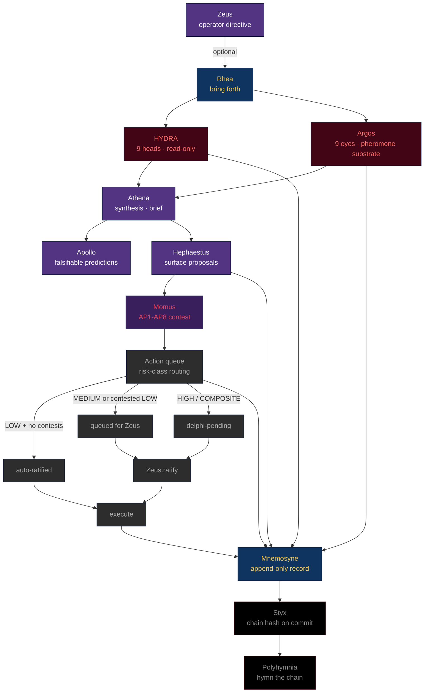

<div align="center">

# ⚡ FLOW ⚡

**the cognitive loop, end to end**

</div>

---

One Olympus session is one pass through this loop. Every link is a god you can name.



---

## The four primitives

Every link uses one or more of these substrate primitives. Read the modules for detail.

| primitive | god | what it is |
|---|---|---|
| **append-only audit-of-record** | Mnemosyne (S1) | every load-bearing event records to a per-kind JSONL with actor + summary |
| **immutable oath chain** | Styx (S6) | SHA-256-chained record of constitutional commitments; tamper detected by Tisiphone |
| **deterministic observation** | Argos (S2, S4) | Eyes scan slices; identical seed → identical pheromones; no Eye imports another |
| **read-only observation** | HYDRA (S3) | Heads observe; never mutate; immortal head watches the mortals |

---

## A single pheromone's journey

```
1. An Argos Eye runs scan() and returns EyeFinding(s)
       ↓
2. The colony wraps each in a Pheromone(deposited_at=now)
       ↓
3. Pheromones append to state/argos_pheromones.jsonl (atomic-append)
       ↓
4. Athena.compose_from() reads the latest census
       ↓
5. Pheromones whose kind == "alert" become high-severity brief findings
       ↓
6. If ≥2 sources (HYDRA + Argos) corroborate on the same slice
   → a brief recommendation surfaces
       ↓
7. Hephaestus.surface_from(brief) emits a Proposal for any alert slice
       ↓
8. Momus.contest_via_brief(proposal, brief) runs AP1-AP8 heuristics
       ↓
9. action_queue.promote(proposal, contests=...) creates an Action,
   status routed by risk class + presence of Momus contests
       ↓
10. (eventually) Zeus.ratify(action_id, quote=...) → status="ratified"
       ↓
11. action_queue.execute(action_id, fn=...) → status="executed"
       ↓
12. Mnemosyne records each transition; Styx oaths any constitutional one
```

---

## What runs when (cadences)

Olympus does not auto-run. The operator (or a cron/event source) triggers each session. Suggested cadences:

| trigger | what to run | who |
|---|---|---|
| every operator session start | `invoke prime` | Zeus, manually |
| on demand or on schedule | `invoke session [<directive>]` | a cron, an event, or Zeus |
| after each session | `invoke action review` | Zeus |
| weekly | `invoke correlate 168` | Zeus |
| any time | `invoke meta` | curiosity |

---

## Failure paths

The loop is wrapped in error boundaries. Failures don't crash the session:

- **A Head raises** → boundary catches it; the head's findings list is empty for that run; the immortal head will notice if it stays silent
- **An Eye raises** → boundary catches it; the eye emits one synthetic ALERT pheromone naming the exception
- **Athena.compose_from raises** → session error captured in `report.error`; session still records to Mnemosyne
- **Hephaestus.surface_from exhausts Lachesis quota** → remaining proposals deferred to next session
- **Action execution raises** → the failure is archived in Hades; the action's status becomes `failed`; the queue is not blocked

---

## What this is NOT

The flow is **not** a multi-agent system. There are no networked agents, no message bus across hosts, no concurrent independent reasoning. Olympus runs in a single Python process, deterministically, per session.

The flow is **not** an LLM agent loop. No language model is invoked. If the operator wants an LLM to participate (e.g., in Athena's synthesis), they wire one via `olympus.llm`. The substrate works without one.

The flow **is** the disciplined sequence by which observations become decisions become recorded actions, with every link readable, replayable, and auditable from the substrate's own records alone.
